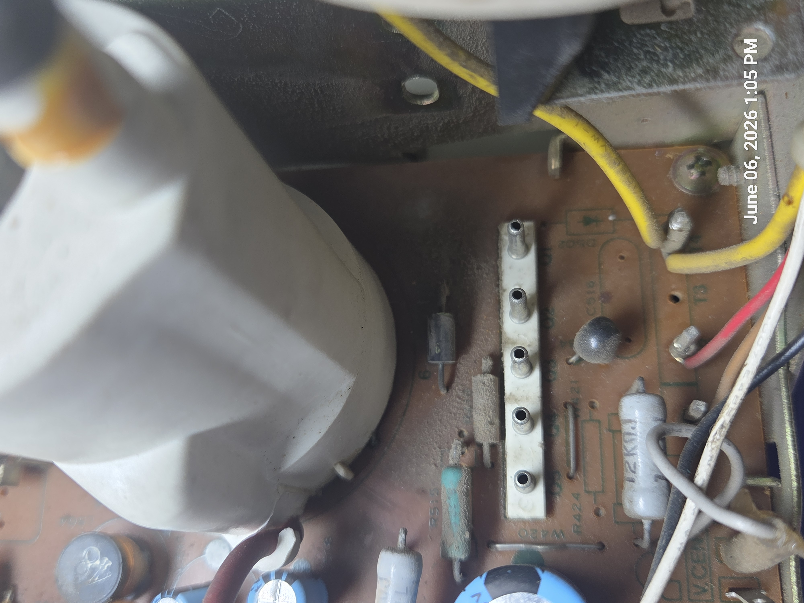
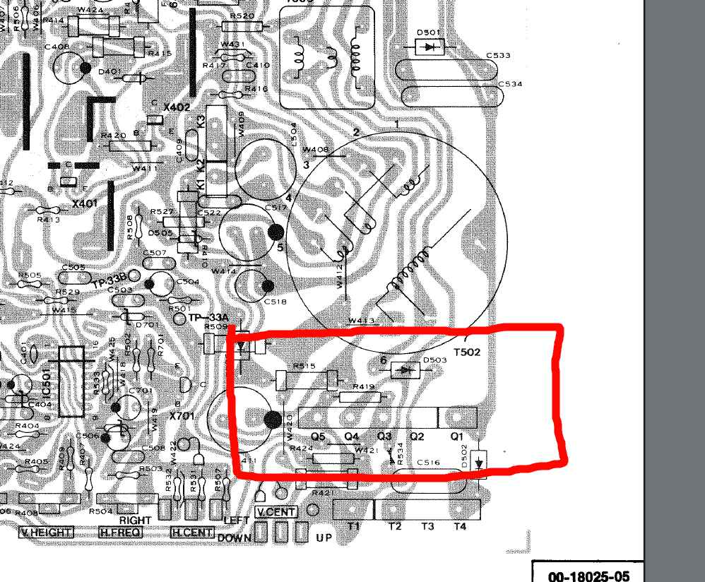
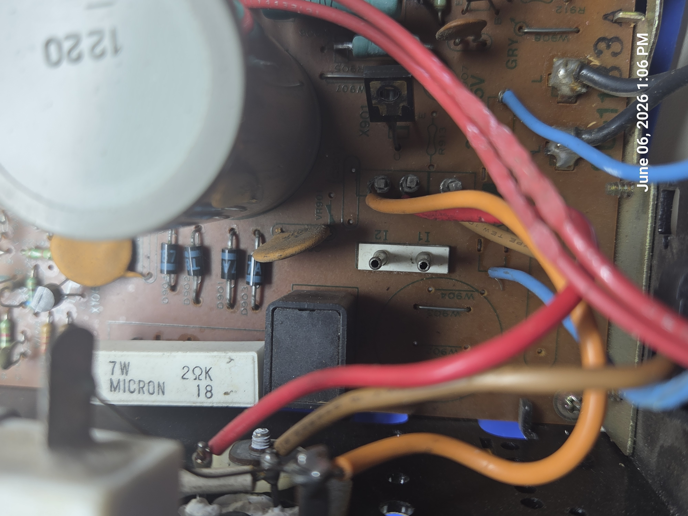
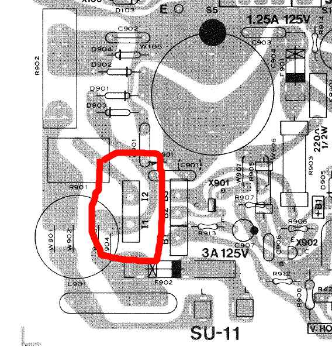

# Electrohome G07 Input Connector Reference

> **Important**
>
> The information below is based on technician notes, and arcade community documentation. While it has been cross-checked against Electrohome factory documentation contained in the G07 service literature there are NO guarantees and use at your own-risk!

---

# Safety

## Isolation Transformer Required

The Electrohome G07 must be powered through an isolation transformer during bench testing.

Recommended power path:

```text
Wall AC
   |
Isolation Transformer
   |
Optional Variac
   |
G07 Chassis
```

Never bypass the isolation transformer when servicing or testing the monitor.

# Connector Summary

| Connector | Pins | Purpose                                  |
| --------- | ---- | ---------------------------------------- |
| J201      | 6    | RGB video + positive H/V sync            |
| J202      | 3    | Alternate sync input                     |
| S1        | 5    | Neckboard interconnect                   |
| Yoke      | 5    | Horizontal and vertical deflection coils |
| I1/I2     | 2    | Degaussing coil                          |


## Video Input Connectors J201 / J202

The Electrohome G07-CB0 uses two adjacent signal connectors for video input.

| Connector | Purpose |
|------------|------------|
| J201 | RGB video, video ground, and separate positive H and V sync inputs |
| J202 | Auxiliary sync connector commonly used for negative sync wiring |
| Location | J202 is directly above J201 on the chassis |

In the photographs:

- Lower 6-pin connector = **J201**
- Upper 3-pin connector = **J202**


---

# Connector Orientation

The orientation below assumes you are viewing the component side of the chassis as shown in the photographs.

## J202

```text
+---+---+---+
| 1 | 2 | 3 |
+---+---+---+
```

## J201

```text
+---+---+---+---+---+---+
| 1 | 2 | 3 | 4 | 5 | 6 |
+---+---+---+---+---+---+
```
---

# J201 Connector

The J201 header uses a Molex KK .156" (3.96 mm) pitch connector.

## Mating Parts

| Item | Molex Part Number |
|--------|--------|
| 6-pin housing | 09-50-3061 |
| Alternate housing | 09-50-8061 |
| Standard female terminal | 08-50-0106 |
| Trifurcon female terminal, recommended | 08-52-0113 |

The Trifurcon contacts are preferred because they grip the monitor header on three sides and are commonly used in arcade harnesses.

## J201 Pinout

| Pin | Function |
|------|------|
| 1 | Red Video |
| 2 | Green Video |
| 3 | Blue Video |
| 4 | Video Ground |
| 5 | Positive Vertical Sync |
| 6 | Positive Horizontal Sync |

The G07 was designed for arcade RGB video levels and generally accepts the output of most original arcade game boards directly.

---

# J202 Connector

J202 is commonly referenced in arcade community documentation for handling negative sync sources.

## Connector Parts

J201/J202 connectors use 0.156" (3.96 mm) pitch.

These are the same connector family commonly used throughout many classic arcade cabinets.

| Item | Molex Part Number |
|--------|--------|
| 3-pin housing | 09-50-3031 |
| Trifurcon terminal | 08-52-0113 |

## J202 Pinout


| Pin | Function |
|------|------|
| 1 | Negative Vertical sync input (commonly tied to pin 2 in composite-sync installations) |
| 2 | Negative Horizontal sync or composite sync input |
| 3 | Ground |

---

# Sync Polarity Notes

One of the most common causes of horizontal roll or vertical instability on a G07 is incorrect sync wiring.

## J201 Expects

- Positive vertical sync
- Positive horizontal sync

## Typical JAMMA / Pi2JAMMA Sources

- Negative composite sync

Because of this mismatch, many arcade installations route RGB through J201 while routing sync through J202.

Symptoms of incorrect sync wiring include:

- Horizontal roll
- Vertical roll
- Failure to lock
- Intermittent sync

Many Pi2JAMMA users find that composite sync connected only to J202 pin 2 works correctly.

If sync lock issues are encountered, try the commonly-used field modification of jumpering J202 pins 1 and 2 together.

---

# Building a Pi2JAMMA Test Harness

## Purpose

This harness allows a Pi2JAMMA, JAMMA PCB, pGenerator, or test pattern source to directly drive a G07 chassis on a workbench.

## Required Parts

### JAMMA Side

- JAMMA fingerboard or extension harness

### G07 Side

| Item | Part Number |
|--------|--------|
| J201 housing | Molex 09-50-3061 |
| J202 housing | Molex 09-50-3031 |
| Female terminals | Molex 08-52-0113 Trifurcon |

---

# Wiring Map

## RGB Signals to J201

Populate only pins 1 through 4.

Leave pins 5 and 6 empty.

| JAMMA Signal | G07 Connector | G07 Pin |
|-------------|-------------|-------------|
| Red Video | J201 | Pin 1 |
| Green Video | J201 | Pin 2 |
| Blue Video | J201 | Pin 3 |
| Video Ground | J201 | Pin 4 |

### Typical JAMMA Video Pins

| JAMMA Pin | Signal |
|-----------|-----------|
| 12, parts side | Red |
| N, solder side | Green |
| 13, parts side | Blue |
| 14 | Ground |

**Note:** Any JAMMA video ground may be used. Multiple grounds are preferred on a bench setup.

---

## Sync Signals to J202

| JAMMA Signal | G07 Connector | G07 Pin |
|-------------|-------------|-------------|
| Composite Sync | J202 | Pins 1 and 2 |
| Ground | J202 | Pin 3 |

## Common Field Wiring Practice

Many technicians wire:

- J202 Pin 1 jumpered to Pin 2
- Composite sync connected to the jumpered pair
- Ground connected to Pin 3

This arrangement is widely reported but should be verified on your specific chassis revision.

---

# Pi2JAMMA Bench Wiring Diagram

```text
Pi2JAMMA
   |
   +-- RGB -------------> J201 Pins 1-4
   |
   +-- Composite Sync --> J202
   |
   +-- Ground ---------> J202 Pin 3

```

---

# Recommended Bench Test Configuration

A practical G07 test bench may consist of:

- Raspberry Pi with Pi2JAMMA
- 240p Test Suite
- JAMMA harness
- Custom G07 adapter harness
- Isolation transformer
- Optional variac
- Optional dim-bulb tester

Useful for:

- Geometry adjustment
- Width adjustment
- Sync troubleshooting
- Color balance
- Purity testing
- Convergence testing

---

# Quick Reference

## J201

| Pin | Function |
|------|------|
| 1 | Red |
| 2 | Green |
| 3 | Blue |
| 4 | Ground |
| 5 | Positive V Sync |
| 6 | Positive H Sync |

## J202

| Pin | Function |
|------|------|
| 1 | Sync input, field wiring |
| 2 | Composite sync |
| 3 | Ground |

## Pi2JAMMA Summary

- RGB to J201 pins 1–4
- Leave J201 pins 5–6 unused
- Composite sync to J202, commonly pins 1 and 2 jumpered
- Ground to J202 pin 3
- Always use an isolation transformer

# Neckboard - Chassis Interconnect S1

The **S1** interface on the **Electrohome G07** arcade monitor chassis serves as the dedicated high-voltage color drive and power distribution link running directly from the main deflection board to the CRT neckboard assembly. 

Early factory manuals list an "S1" footprint intended for an alternate color pattern service generator input. However, on physical production chassis implementations (such as those widely used in *Ms. Pac-Man* cabinets), this physical header is populated with a heavy-duty, large-format round-pin wafer header to safely route high-amplitude cathode drive voltages and filament current to the neckboard.


---

## S1 Connector Specifications

This connector uses robust, thick round pins similar to Molex .093" designed to handle thermal stress, high voltage transitions, and high-current AC filament paths without arcing.

| Parameter | Specification |
| :--- | :--- |
| **Circuit Designator** | S1 |
| **Connector Family Style** | .093" Pin & Socket / Custom Wafer Type |
| **Pin Shape** | Solid Round Cylindrical Posts |
| **Pin Diameter** | 2.36 mm (0.093 inches) |
| **Pitch Pattern** | Asymmetric / Polarized Stepped Pitch |
| **Pin 1 to Pin 2 Spacing** | **10.0 mm (0.394 inches)** (Visual Gap Anchor) |
| **Pins 2 through 5 Spacing** | **8.0 mm (0.315 inches)** standard spacing |
| **PCB Footprint Location** | Directly adjacent to the **1.25A 125V** line fuse (F902) |

### Replacement Part Numbers
*   **Chassis Male Wafer Header**: Molex/Generic `CP1008` Series (Custom 5-Pin, 2.36mm polarized layout)
*   **Wire Harness Female Housing**: Part Number `CM1004` (5-Pin Pole Straight Plug Crimp Shell)
*   **Female Internal Crimp Terminals**: Standard Molex .093" Crimp Sockets (Series 1189 or 1381, sized for 18–22 AWG wire)

---

## S1 Pin-Out Configuration & Signal Mapping

The pinout runs sequentially from **left to right** as oriented on the chassis component side (viewing the assembly with the wider 10.0mm visual gap located on the far left side):


| Pin Number | Wire Color | Destination Line | Function & Signal Class |
| :--- | :--- | :--- | :--- |
| **Pin 1** | Blue | **KB** | Blue Cathode High-Voltage Drive |
| **Pin 2** | Green | **KG** | Green Cathode High-Voltage Drive |
| **Pin 3** | Red | **KR** | Red Cathode High-Voltage Drive |
| **Pin 4** | Black | **GND** | Main Chassis Ground Return Plane |
| **Pin 5** | Brown | **H / FIL** | Heater / CRT Filament Power (Low Voltage AC) |

---

## S1 Critical Bench Notes & Maintenance

### Asymmetric Polarized Spacing
The wide **10.0 mm gap between Pin 1 and Pin 2** functions as a foolproof mechanical key. This prevents technicians from accidentally plugging the connector in backward, which would otherwise cross-wire high-voltage color cathode lines directly into the ground plane or low-voltage heater filament loop, destroying components instantly.

### Proximity to Fuse F902
The solder pads for header S1 are located directly adjacent to the high-temperature traces of the `1.25A 125V` pigtail fuse (F902). Due to decades of exposure to ambient heat from the fuse and the nearby power supply sections, the copper traces directly underneath the S1 pads are fragile. Use caution and low-temperature solder profiles when replacing or reflowing this header to avoid lifting circuit traces.

### S1 Common Failure Symptoms
*   **Intermittent Color Dropouts**: Loose or oxidized female contacts inside the `CM1004` plug shell can cause one of the primary cathode lines (Pins 1, 2, or 3) to lose connection, creating a temporary screen tint (e.g., losing the Red line results in a heavy cyan screen tint). 
*   **No Neck Glow (Dead CRT Screen)**: A loose crimp or broken wire on Pin 5 (Brown) will cut off the AC voltage required to light up the CRT neck filaments, preventing electron emission entirely.

# Deflection Yoke Plug (T502 Area)

The **Yoke Interconnect** (located physically underneath the Flyback Transformer **T502** on the PCB layout) serves as the primary power and signal routing bridge between the main deflection circuits and the copper deflection coils wrapped around the CRT neck funnel. 

Because the horizontal deflection loop operates using high-frequency scanning currents and carries inductive flyback retrace pulses exceeding **1200V Peak-to-Peak**, this interface is designed to survive high voltage spikes, thermal loading, and constant vibration. It uses heavy-duty round-pin wafer technology to prevent dielectric breakdown and terminal arcing.





---

## Yoke Plug Connector Mechanical & Material Specifications

The physical layout utilizes an asymmetrical, stepped-pitch design. This design serves as a hardware-level keying mechanism to ensure correct orientation during installation.


| Parameter | Specification |
| :--- | :--- |
| **Chassis Designation** | T502 / Yoke Header |
| **Connector Family Type** | .093" Pin & Socket / Large Format Wafer Header |
| **Contact Geometry** | Solid Round Cylindrical Posts |
| **Pin Post Diameter** | 2.36 mm (0.093 inches) |
| **Total Positions** | 5 Pins (4 Conductors active on standard harnesses) |
| **Polarization Keying** | Asymmetric Stepped Pitch |
| **Pin 1 to Pin 2 Distance** | **10.0 mm (0.394 inches)** (Visual Gap Key) |
| **Pins 2 through 5 Distance**| **8.0 mm (0.315 inches)** center-to-center |
| **Substrate Location** | Mounted directly below Flyback Transformer (T502) |

### IYoke Plug ndustrial Sourcing Part Numbers
*   **Chassis-Side Male Wafer Header**: Molex/Generic `CP1008` Series (Custom 5-Pin, 2.36mm polarized layout)
*   **Wire-Side Female Harness Housing**: Part Number `CM1004` (5-Pin Pole Straight Plug Crimp Shell)
*   **Internal Female Crimp Terminals**: Standard Molex .093" Crimp Sockets (Series 1189 or 1381, matching 18–22 AWG wire)

---

## Yoke Plug Pin-Out Configuration & Deflection Mapping

The tracking sequence runs **left to right** when viewing the chassis from the component side, anchoring from the wide **10.0 mm gap** located on the far left (closest to the large blue electrolytic filter capacitor).


| Pin Number | Visual Spacing | Factory Wire Color | Deflection Channel | Circuit Function / Node Destination |
| :--- | :--- | :--- | :--- | :--- |
| **Pin 1** | **-- 10mm Gap --** | Red | **Horizontal (H1)** | High-Voltage Horizontal Deflection Drive from Flyback/H.O.T. |
| **Pin 2** | **-- 8mm Gap --** | Blue / White | **Horizontal (H2)** | Horizontal Deflection Return path through the Width/Linearity loop |
| **Pin 3** | **-- 8mm Gap --** | *No Pin / Empty* | **NC** | Unused / Blind spacing isolation lane |
| **Pin 4** | **-- 8mm Gap --** | Green | **Vertical (V1)** | Vertical Deflection Output driven by the Vertical Amplifier IC |
| **Pin 5** | **-- End --** | Yellow | **Vertical (V2)** | Vertical Deflection Return path to Ground/Feedback loop |

---

## Yoke Plug Bench & Diagnostic Notes

### The 10.0mm Air Gap Feature
The unusually wide 10.0 mm spacing between Pin 1 and Pin 2 serves two separate engineering functions:
1.  **Arc Suppression**: Pin 1 experiences raw inductive kickback voltages from the horizontal coils. The extra space isolates this line from the rest of the board to prevent carbon tracking and PCB charring.
2.  **Chassis Protection**: This spacing acts as an idiot-proof orientation guide. Reversing the connector would cross-wire the **1.2kV horizontal retrace pulse** directly into the low-voltage vertical output amplifier IC. This would cause an immediate catastrophic failure across multiple board sections.

### Yoke Plug Common Failures

#### Thermal Degradation & Melted Shells
High current through the horizontal lines (Pins 1 and 2) creates local heat if the internal crimp connections oxidize. This contact resistance will often bake the white plastic housing brittle, causing it to discolor, turn brown, or melt entirely at Pin 1. 

#### Solder Fatigue (Cold Joints)
Because the yoke wiring harness pulls away toward the CRT funnel, it exerts constant mechanical tension on the chassis header. Combined with thermal cycling from the nearby flyback transformer, the solder joints beneath Pins 1, 2, 4, and 5 are highly susceptible to ring cracks.

#### Distinct Failure Modes
*   **Horizontal Open (Pins 1 or 2)**: Breaks the primary current loop, tripping the power supply's over-current protection or immediately blowing the main fuse.
*   **Vertical Collapse (Pins 4 or 5)**: If either vertical pin loses connectivity due to a cracked solder joint, the monitor will exhibit immediate **vertical collapse**—shrinking the picture into a single, razor-thin horizontal line across the center of the tube.

# Degaussing Coil Connector (I1 / I2)

The **Degaussing Connector** (labeled **`I1`** and **`I2`** on the main circuit board footprint) provides the dedicated high-current AC voltage interface to drive the degaussing ring mounted around the CRT's exterior perimeter frame. 

This sub-circuit acts automatically upon cold power-up to clear stray ambient magnetic fields that cause localized screen color impurity or shadowing on the picture tube. Because it momentarily handles raw AC line current before transitioning to an open-circuit state, it utilizes a specialized heavy-duty, large-format round cylindrical pin design.





---

## Degaussing Coil Connector Mechanical & Component Specifications

The component uses a heavy-duty, polarized 2-pin header configuration. It is scaled exactly like the larger 5-pin yoke and neckboard sockets to accommodate thick wires and handle sudden high-current inductive transitions.


| Parameter | Specification |
| :--- | :--- |
| **Circuit Designator** | I1 / I2 |
| **Connector Family Style** | .093" Pin & Socket / Large Format Wafer Header |
| **Contact Geometry** | Solid Round Cylindrical Posts |
| **Pin Post Diameter** | 2.36 mm (0.093 inches) |
| **Total Active Positions** | 2 Pins |
| **Center-to-Center Pitch** | **10.0 mm (0.394 inches)** (Visual Wide Air Gap) |
| **Substrate Location** | Mounted between the Main AC Filter Capacitor (C901) and the large white 7W 22kΩ Power Resistor (R901) |

### Degaussing Coil Connector Material Sourcing & Retrofitting Part Numbers
Because of the heavy 10mm wide pitch spacing, standard modern logic-level pin headers will not drop into this footprint. If restoring or repairing burnt sockets, use:
*   **Chassis-Side Male Wafer Header**: Molex/Generic `CP1005` Series (Custom 2-Pin, 2.36mm layout with 10mm pitch)
*   **Wire-Side Female Harness Housing**: Part Number `CM1001` or equivalent (2-Pin Straight Plug Crimp Shell)
*   **Internal Female Crimp Terminals**: Standard Molex .093" Crimp Sockets (Series 1189 or 1381, sized for 18–22 AWG wire)

---

## Degaussing Coil Connector Pin-Out Configuration & Circuit Flow

Unlike the DC signal interfaces, this header carries an independent AC line circuit in loop series with a **Posistor (Thermistor)** element. 


| Pin Number | PCB Silkscreen | Standard Wire Color | Circuit Target | Functional Voltage Class |
| :--- | :--- | :--- | :--- | :--- |
| **Pin 1** | **I1** | Orange / Black | **Degauss Coil Loop In** | AC from the monitor power supply path (~120VAC line loop) |
| **Pin 2** | **I2** | Orange / Black | **Degauss Coil Loop Out** | Return leg feeding into the Thermistor/Posistor circuit |

---

## Degaussing Coil Connector Circuit Theory & Operations 

### The Automatic Surge Mechanism
When the arcade machine is flipped on from a **cold state**, the automatic degaussing circuit acts as a momentary controlled short across the incoming isolated AC voltage line:
1. At turn-on, the **Posistor (VR901)**—the disc-shaped ceramic element sitting immediately adjacent to the large filter capacitor—is completely cold and exhibits extremely low resistance.
2. This low resistance allows a large, brief burst of alternating current (several amps) to surge out of **Pin I1**, flow entirely around the thick copper degaussing coil on the tube frame, and return through **Pin I2**.
3. This massive AC burst creates a fluctuating magnetic field that scrambles and neutralizes any localized magnetic pocket traps on the internal shadow mask of the CRT.
4. Within **1 to 3 seconds**, the high current flow causes the internal element of the Posistor to heat up rapidly. As its temperature spikes, its electrical resistance rises to an near-infinite level.
5. This high resistance chokes the current draw down to a negligible trickle, essentially cutting off power to the degaussing coil and making it electrically dormant for the remainder of your gaming session.

---

## Degaussing Coil Connector Bench Notes & Troubleshooting

### "Black Wire Ground" Blunder
> ⚠️ **CRITICAL WARNING:** A very common, catastrophic mistake made by amateur restorers involves mixing up the loose chassis ground braid wire with the degaussing loop. Because the black chassis ground wire uses a matching terminal plug shell in some configurations, technicians sometimes split it and accidentally force it onto the **I1 / I2** header. Doing this bridges the isolated AC mains loop straight into the monitor's logic and signal ground plane, immediately destroying the primary power supply components, blowing traces, and presenting a severe shock hazard.

### Solder Fatigue and Fractured Pads
The degaussing loop's high-current burst puts significant thermal cycles on the solder pads directly beneath `I1` and `I2`. Over time, the solder will crack circularly around the 2.36mm pin roots. 
* **Symptom**: Localized arc pops, intermittent screen shaking on cold start, or a total loss of automatic degaussing (visible as purple, green, or rainbow color pooling in the corners of the screen).

### Burned Posistors (VR901)
If the internal ceramic material inside the Posistor degrades or fractures, it can fail in one of two ways:
* **Fail Open**: The degaussing circuit never switches on. Color purity patches remain permanently on the screen until a manual handheld degaussing wand is used.
* **Fail Short / Partial Short**: The Posistor fails to choke out the current after 3 seconds. The AC line continues to pump current through the degauss loop constantly. This causes severe, continuous wavy screen distortion and will bake the degaussing coil hot until the main power fuse pops or the Posistor physically cracks open and smokes.

