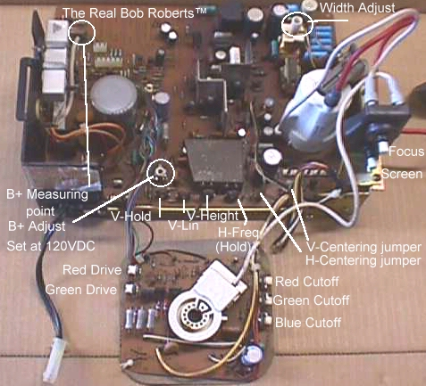
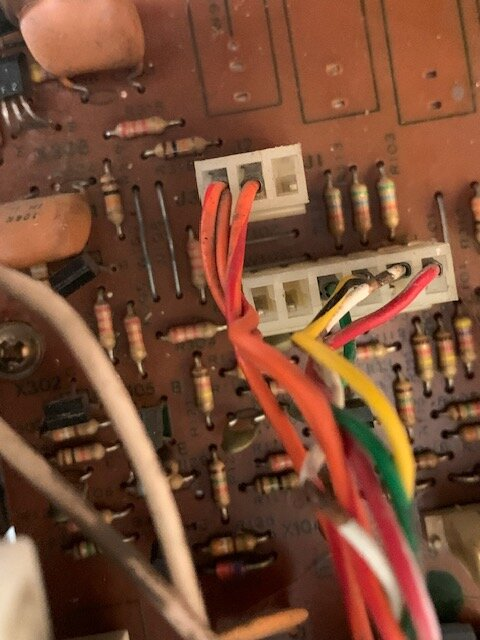
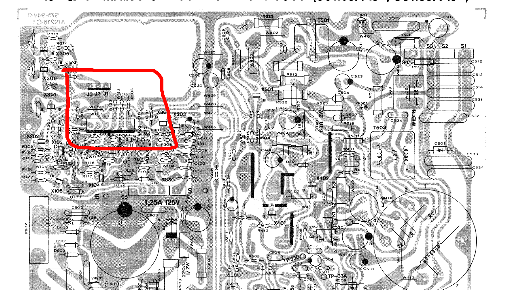
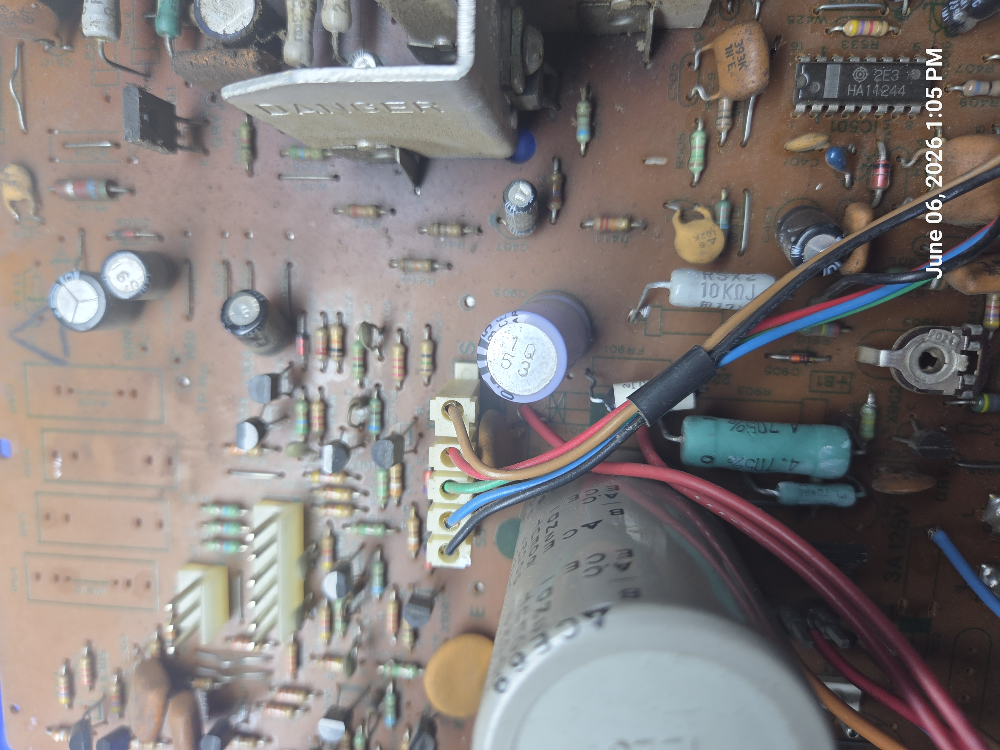

# Electrohome G07 Video Input Connectors (J201 / J202)
## Complete Reference and Pi2JAMMA Test Harness Guide

## Overview

The Electrohome G07-CB0 uses two adjacent signal connectors for video input.

| Connector | Purpose |
|------------|------------|
| J201 | RGB video input and positive H/V sync |
| J202 | Auxiliary sync connector commonly used for negative sync wiring |
| Location | J202 is directly above J201 on the chassis |

In the photographs:

- Lower 6-pin connector = **J201**
- Upper 3-pin connector = **J202**







---

# Connector Orientation

The orientation below assumes you are viewing the component side of the chassis as shown in the photographs.

## J202

```text
+---+---+---+
| 1 | 2 | 3 |
+---+---+---+
```

## J201

```text
+---+---+---+---+---+---+
| 1 | 2 | 3 | 4 | 5 | 6 |
+---+---+---+---+---+---+
```

---

# J201 Connector

The J201 header uses a Molex KK .156" (3.96 mm) pitch connector.

## Mating Parts

| Item | Molex Part Number |
|--------|--------|
| 6-pin housing | 09-50-3061 |
| Alternate housing | 09-50-8061 |
| Standard female terminal | 08-50-0106 |
| Trifurcon female terminal, recommended | 08-52-0113 |

The Trifurcon contacts are preferred because they grip the monitor header on three sides and are commonly used in arcade harnesses.

## J201 Pinout

| Pin | Function |
|------|------|
| 1 | Red Video |
| 2 | Green Video |
| 3 | Blue Video |
| 4 | Video Ground |
| 5 | Positive Vertical Sync |
| 6 | Positive Horizontal Sync |

### Typical Signal Levels

| Signal | Typical Range |
|----------|----------|
| RGB Video | 0–4 V |
| Positive Sync | +2 to +4 V |

---

# J202 Connector

J202 is commonly referenced in arcade community documentation for handling negative sync sources.

## Connector Parts

| Item | Molex Part Number |
|--------|--------|
| 3-pin housing | 09-50-3031 |
| Trifurcon terminal | 08-52-0113 |

## J202 Pinout

> **Important**
>
> The J202 information below is based on field wiring practices, technician notes, and arcade community documentation. It has not been verified against Electrohome factory documentation contained in the G07 service literature.

| Pin | Function |
|------|------|
| 1 | Negative Vertical Sync, field documentation |
| 2 | Negative Horizontal / Composite Sync |
| 3 | Ground |

---

# Existing Harness Observations

Based on the photographed monitor harness:

## J201

Appears to carry:

- Red
- Green
- Blue
- Video Ground

## J202

Appears to carry:

- Sync
- Ground

This arrangement is commonly seen on arcade installations using negative composite sync.

---

# Sync Polarity Notes

One of the most common causes of horizontal roll or vertical instability on a G07 is incorrect sync wiring.

## J201 Expects

- Positive vertical sync
- Positive horizontal sync

## Typical JAMMA / Pi2JAMMA Sources

- Negative composite sync

Because of this mismatch, many arcade installations route RGB through J201 while routing sync through J202.

Symptoms of incorrect sync wiring include:

- Horizontal roll
- Vertical roll
- Failure to lock
- Intermittent sync

---

# Building a Pi2JAMMA Test Harness

## Purpose

This harness allows a Pi2JAMMA, JAMMA PCB, pGenerator, or test pattern source to directly drive a G07 chassis on a workbench.

## Required Parts

### JAMMA Side

- JAMMA fingerboard or extension harness

### G07 Side

| Item | Part Number |
|--------|--------|
| J201 housing | Molex 09-50-3061 |
| J202 housing | Molex 09-50-3031 |
| Female terminals | Molex 08-52-0113 Trifurcon |

---

# Wiring Map

## RGB Signals to J201

Populate only pins 1 through 4.

Leave pins 5 and 6 empty.

| JAMMA Signal | G07 Connector | G07 Pin |
|-------------|-------------|-------------|
| Red Video | J201 | Pin 1 |
| Green Video | J201 | Pin 2 |
| Blue Video | J201 | Pin 3 |
| Video Ground | J201 | Pin 4 |

### Typical JAMMA Video Pins

| JAMMA Pin | Signal |
|-----------|-----------|
| 12, parts side | Red |
| N, solder side | Green |
| 13, parts side | Blue |
| 14 | Ground |

**Note:** Any JAMMA video ground may be used. Multiple grounds are preferred on a bench setup.

---

## Sync Signals to J202

| JAMMA Signal | G07 Connector | G07 Pin |
|-------------|-------------|-------------|
| Composite Sync | J202 | Pins 1 and 2 |
| Ground | J202 | Pin 3 |

## Common Field Wiring Practice

Many technicians wire:

- J202 Pin 1 jumpered to Pin 2
- Composite sync connected to the jumpered pair
- Ground connected to Pin 3

This arrangement is widely reported but should be verified on your specific chassis revision.

---

# Pi2JAMMA Bench Wiring Diagram

```text
Pi2JAMMA
   |
   +-- RGB -------------> J201 Pins 1-4
   |
   +-- Composite Sync --> J202
   |
   +-- Ground ---------> J202 Pin 3

G07 Chassis
   |
Isolation Transformer
   |
120 VAC
```

---

# Recommended Bench Test Configuration

A practical G07 test bench may consist of:

- Raspberry Pi with Pi2JAMMA
- 240p Test Suite
- JAMMA harness
- Custom G07 adapter harness
- Isolation transformer
- Optional variac
- Optional dim-bulb tester

Useful for:

- Geometry adjustment
- Width adjustment
- Sync troubleshooting
- Color balance
- Purity testing
- Convergence testing

---

# Safety

## Isolation Transformer Required

The Electrohome G07 must be powered through an isolation transformer during bench testing.

Recommended power path:

```text
Wall AC
   |
Isolation Transformer
   |
Optional Variac
   |
G07 Chassis
```

Never bypass the isolation transformer when servicing or testing the monitor.

---

# Quick Reference

## J201

| Pin | Function |
|------|------|
| 1 | Red |
| 2 | Green |
| 3 | Blue |
| 4 | Ground |
| 5 | Positive V Sync |
| 6 | Positive H Sync |

## J202

| Pin | Function |
|------|------|
| 1 | Sync input, field wiring |
| 2 | Composite sync |
| 3 | Ground |

## Pi2JAMMA Summary

- RGB to J201 pins 1–4
- Leave J201 pins 5–6 unused
- Composite sync to J202, commonly pins 1 and 2 jumpered
- Ground to J202 pin 3
- Always use an isolation transformer

# Neckboard - Chassis Interconnect S1



## 1. Overview
The **S1** interface on the **Electrohome G07** arcade monitor chassis serves as the dedicated high-voltage color drive and power distribution link running directly from the main deflection board to the CRT neckboard assembly. 

Historically, early factory manuals list an "S1" footprint intended for an alternate color pattern service generator input. However, on physical production chassis implementations (such as those widely used in *Ms. Pac-Man* cabinets), this physical header is populated with a heavy-duty, large-format round-pin wafer header to safely route high-amplitude cathode drive voltages and filament current to the neckboard.

---

## 2. Connector Specifications

Unlike the smaller signal headers (e.g., J201, J202), this connector uses robust, thick round pins designed to handle thermal stress, high voltage transitions, and high-current AC filament paths without arcing.


| Parameter | Specification |
| :--- | :--- |
| **Circuit Designator** | S1 |
| **Connector Family Style** | .093" Pin & Socket / Custom Wafer Type |
| **Pin Shape** | Solid Round Cylindrical Posts |
| **Pin Diameter** | 2.36 mm (0.093 inches) |
| **Pitch Pattern** | Asymmetric / Polarized Stepped Pitch |
| **Pin 1 to Pin 2 Spacing** | **10.0 mm (0.394 inches)** (Visual Gap Anchor) |
| **Pins 2 through 5 Spacing** | **8.0 mm (0.315 inches)** standard spacing |
| **PCB Footprint Location** | Directly adjacent to the **1.25A 125V** line fuse (F902) |

### Replacement Part Numbers
*   **Chassis Male Wafer Header**: Molex/Generic `CP1008` Series (Custom 5-Pin, 2.36mm polarized layout)
*   **Wire Harness Female Housing**: Part Number `CM1004` (5-Pin Pole Straight Plug Crimp Shell)
*   **Female Internal Crimp Terminals**: Standard Molex .093" Crimp Sockets (Series 1189 or 1381, sized for 18–22 AWG wire)

---

## 3. Pin-Out Configuration & Signal Mapping

The pinout runs sequentially from **left to right** as oriented on the chassis component side (viewing the assembly with the wider 10.0mm visual gap located on the far left side):


| Pin Number | Wire Color | Destination Line | Function & Signal Class |
| :--- | :--- | :--- | :--- |
| **Pin 1** | Blue | **KB** | Blue Cathode High-Voltage Drive |
| **Pin 2** | Green | **KG** | Green Cathode High-Voltage Drive |
| **Pin 3** | Red | **KR** | Red Cathode High-Voltage Drive |
| **Pin 4** | Black | **GND** | Main Chassis Ground Return Plane |
| **Pin 5** | Brown | **H / FIL** | Heater / CRT Filament Power (Low Voltage AC) |

---

## 4. Critical Bench Notes & Maintenance

### Asymmetric Polarized Spacing
The wide **10.0 mm gap between Pin 1 and Pin 2** functions as a foolproof mechanical key. This prevents technicians from accidentally plugging the connector in backward, which would otherwise cross-wire high-voltage color cathode lines directly into the ground plane or low-voltage heater filament loop, destroying components instantly.

### Proximity to Fuse F902
The solder pads for header S1 are located directly adjacent to the high-temperature traces of the `1.25A 125V` pigtail fuse (F902). Due to decades of exposure to ambient heat from the fuse and the nearby power supply sections, the copper traces directly underneath the S1 pads are fragile. Use caution and low-temperature solder profiles when replacing or reflowing this header to avoid lifting circuit traces.

### Common Failure Symptoms
*   **Intermittent Color Dropouts**: Loose or oxidized female contacts inside the `CM1004` plug shell can cause one of the primary cathode lines (Pins 1, 2, or 3) to lose connection, creating a temporary screen tint (e.g., losing the Red line results in a heavy cyan screen tint). 
*   **No Neck Glow (Dead CRT Screen)**: A loose crimp or broken wire on Pin 5 (Brown) will cut off the AC voltage required to light up the CRT neck filaments, preventing electron emission entirely.

